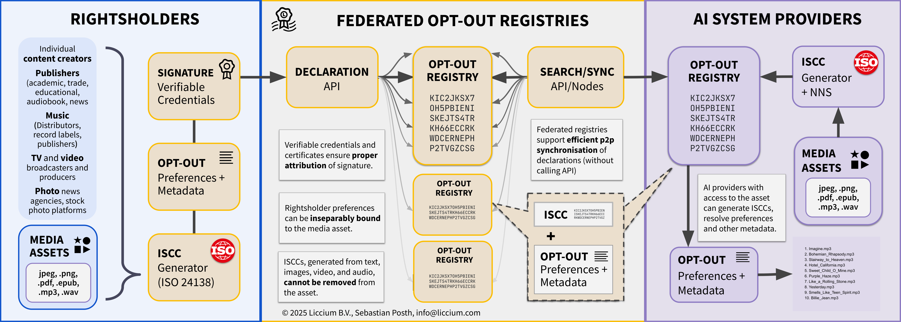

# What is the TDM·AI Protocol?

<figure><figcaption></figcaption></figure>

## Abstract&#x20;

TDM·AI is an attachment mechanism that enables creators and rightsholders to persistently and verifiably attach machine-readable usage preferences – such as an opt-out from text and data mining (TDM), automated processing, or AI training – to their digital works.

TDM·AI addresses the challenge of expressing and binding AI training and usage preferences for individual digital media assets. The protocol provides a consistent way to declare permissions or restrictions regarding the use of content in AI model training by linking these declarations to content-derived identifiers and digital fingerprints.

It uses the International Standard Content Code (ISCC [ISO 24138:2024](https://www.iso.org/standard/77899.html)) for asset identification and cryptographically verifiable  [Creator Credentials](https://docs.creatorcredentials.com/), based on [W3C recommendation for cryptographically verifiable credentials](https://www.w3.org/TR/vc-data-model-2.0/). This ensures that declarations are both verifiable and attributable to legitimate rightsholders or controllers of the content.

Originally developed in the context of Article 4 of the European Directive 2019/790 (DSM Directive), TDM·AI is applicable across jurisdictions and allows rightsholders worldwide to express usage preferences in a structured and interoperable way.

## Motivation

Given the current digital AI landscape in the context of an evolving international regulatory environment, there is an urgent need for a reliable way for content creators and other rightsholders to declare their consent or reservation to automated processing (TDM) for the purpose of training models and applications of generative AI, capable of generating text, images, and other content.&#x20;

The TDM·AI protocol aims to provide creators and other rightsholders with a simple and standardised way to make a machine-readable declaration as to whether or not their content may or may not be used for these specific purposes. The key differentiator of the TDM-AI protocol is that the AI preferences, can be resolved directly from the content-derived identifier, the ISCC code, meaning that it is easily accessible to users such as AI providers using open-source identifier technology.&#x20;

By using ISCC, the protocol ensures a reliable method of identifying content that is robust to common problems such as the loss of embedded metadata, removal of watermarks or steganographic data, or other alteration or manipulation of content.&#x20;

The use of verifiable credentials adds a further layer of trust and verifiability, ensuring that the declarations are genuine and can be traced back to the original rightsholder, depending on their privacy needs and preferences.

The TDM·AI protocol is motivated by the need to:

* Provide a clear and simple way for rightsholders to declare rightsholders' preferences with regards to training models of generative AI;
* Ensure that AI providers and other stakeholders can easily read, understand and respect rightsholders' preferences by machine technology.

## Overview

<figure><figcaption>
Overview
</figcaption></figure>
