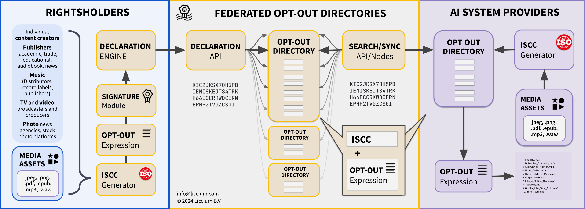

# TDM·AI Protocol

<figure><figcaption></figcaption></figure>

## Abstract&#x20;

TDM·AI is a protocol for creators and rightsholders to inseparably bind their machine-readable preferences for text and data mining (TDM) to digital media assets, specifically tailored for training models and applications of generative AI. TDM·AI addresses the main problem in controlling AI crawlers, namely the problem of metadata binding, by proposing a reliable method of soft-binding restrictions or permissions to use content for training models of generative AI to content-derived identifiers.&#x20;

The TDM·AI protocol utilises the International Standard Content Code (ISCC [ISO 24138:2024](https://www.iso.org/standard/77899.html)), a new ISO standard for the identification of digital media content (ISO 24138:2024) and [Creator Credentials](https://docs.creatorcredentials.com/), based on [W3C recommendation for cryptographically verifiable credentials](https://www.w3.org/TR/vc-data-model-2.0/), to ensure that verifiable and machine-readable declarations include proper attribution of preferences and claims to the legitimate rightsholders. Although the protocol has its origins in the European DSM Directive on Copyright 2019/790, Article 4, it may in many cases also be applicable to content published by rightsholders outside the EU.

## Motivation

Given the current digital AI landscape in the context of an evolving international regulatory environment, there is an urgent need for a reliable way for content creators and other rightsholders to declare their consent or reservation to TDM for the purpose of training models and applications of generative AI, capable of generating text, images, and other content. The TDM·AI protocol aims to provide creators and other rightsholders with a simple and standardised way to make a machine-readable declaration as to whether or not their content may or may not be used for this specific purpose. The key differentiator of the TDM-AI protocol is that the opt-out declaration – or its revocation, which could potentially facilitate a licensing transaction – can be resolved directly from the content-derived identifier, the ISCC code, meaning that it is easily accessible to users such as AI providers using open-source identifier technology. By using ISCC, the protocol ensures a reliable method of identifying content that is robust to common problems such as the loss of embedded metadata, removal of watermarks or steganographic data, or other alteration or manipulation of content. The use of verifiable credentials adds a further layer of trust and verifiability, ensuring that the declarations are genuine and can be traced back to the original rightsholder, depending on their privacy needs and preferences.

The TDM·AI protocol is motivated by the need to:

* Provide a clear and simple way for rightsholders to declare their rightsholder preferences with regards to training models of generative AI;
* Ensure that AI providers and other stakeholders can easily read, understand and respect rightsholder preferences by machine technology.

## Overview

<figure><figcaption>
Overview TDM·AI
</figcaption></figure>
