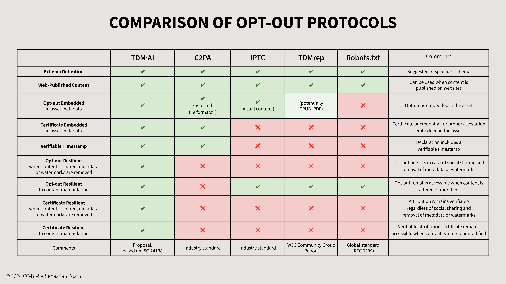

# Comparison and Compatibility

## Comparison

<figure><figcaption>
Comparison opt-out declaration protocols
</figcaption></figure>

## Compatibility&#x20;

This table tries to provide a neutral overview over existing (not all) methods to opt-out. It depends on the use case which method would work for the individual creator or rightsholder.  The use of the TDM·AI protocol does not exclude the use of other methods. It is compatible with all methods to express terms for TDM for AI.&#x20;
