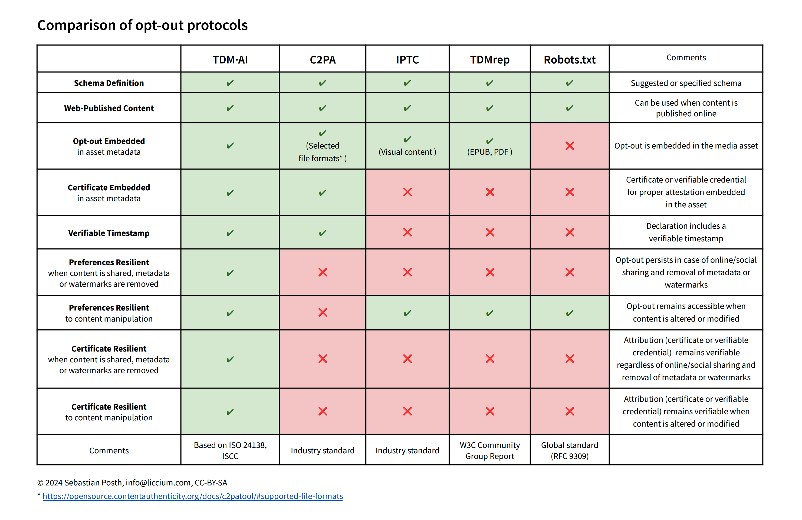

---
layout:
  title:
    visible: true
  description:
    visible: false
  tableOfContents:
    visible: true
  outline:
    visible: true
  pagination:
    visible: true
---

# Advantages of Opt-Out Registries

## The TDM·AI Protocol

The TDM·AI protocol proposes a reliable method of binding rightsholders' preferences to the content-derived identifier and digital fingerprint of the media file. Creators and rightsholders can generate ISCC codes directly from their content and choose the rightsholder preference for the content. ISCC codes and the selected preferences can be publicly declared in a network of open, centralised or federated, verifiable metadata directories.&#x20;

These directories persistently bind the rightsholders' preferences to the unique identifier of the media asset (ISCC Codes) – and ‘persistently’ means: the data cannot be separated or removed. Federated directories have to be publicly accessible to discover ISCC codes, resolve associated rightsholder preferences and verify the authenticity and originality of the declarations.&#x20;

> **"Looking at the current landscape of unit-based identifiers, an approach based on a content derived identifier such as the ISCC to identify opted-out works and record opt-outs via the proposed standardised vocabulary seems viable for at least some categories of works. Such a registry would soft-bind opt-out declarations based on the standardised vocabulary to ISCC codes. This would allow AI model trainers to use ISCC codes as a look-up key to check the registry for known opt-outs."** \
> **(**&#x4F;pen Future Foundation, Considerations For Opt-out Compliance Policies by AI model Developers, [https://openfuture.eu/wp-content/uploads/2024/05/240516considerations\_of\_opt-out\_\
> compliance\_policies.pdf](https://openfuture.eu/wp-content/uploads/2024/05/240516considerations_of_opt-out_compliance_policies.pdf))

Since anyone can make a public declaration, it is important to ensure proper authentication of the source of each declaration. To increase trustworthiness, it is suggested that declaration metadata will include publicly accessible verifiable credentials (VCs), which are based on the W3C standards for Verifiable Credentials, supported by advanced and qualified certificates that properly identify creators and rightsholders. These "Creator Credentials'' serve as a means for attribution and authentication of creators and rightsholders based on social or institutional authentication, thereby increasing trust in claims and attribution. Creator Credentials provide creators and rightsholders with a sovereign, portable and interoperable way of managing their digital identities.&#x20;

All declarations are digitally signed and provided with verifiable timestamps to ensure their accuracy, validity and transparency as to when exactly the opt-out declaration was published – an aspect often overlooked in the current discussion about opt-out declarations.

## Comparison of Opt-Out Protocols

<figure><figcaption></figcaption></figure>

## Compatibility&#x20;

This table tries to provide an objective overview over existing (not all) methods to opt-out. It depends on the use case which method would work for the individual creator or rightsholder.  The use of the TDM·AI protocol does not exclude the use of other methods. It is compatible with all methods to express terms for TDM for AI. \
