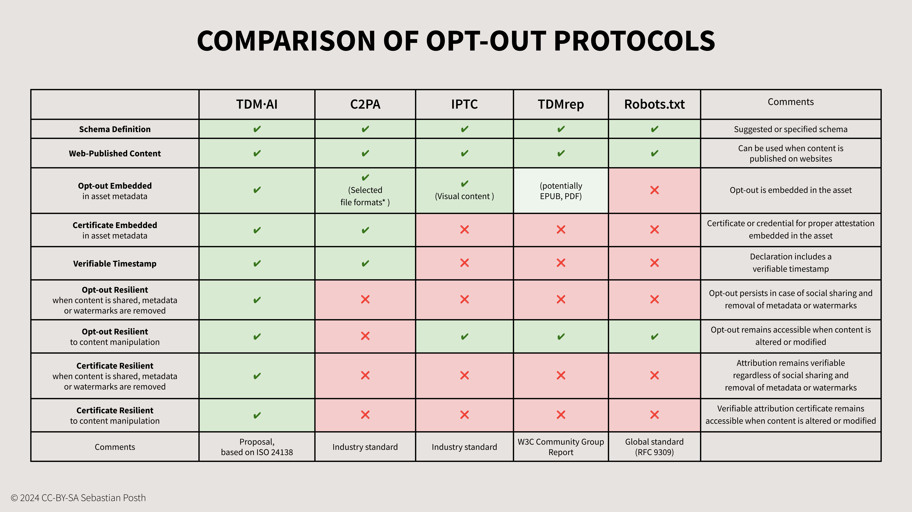

# Options for Metadata Binding

When it comes to managing opt-out declarations for TDM in a machine-readable way, three different approaches are discussed:&#x20;

1. Location/Domain-Based Binding – Rightsholder preferences for web-published content are included in robots.txt-file or in HTML/HTTP metadata of the domain, e.g. Robots.txt, TDMrep;
2. Hard-Binding – Metadata is embedded directly into the media file, e.g. C2PA.org;&#x20;
3. Soft-Binding – Metadata is provided in an external (sidecar) file and linked to the ISCC code.

## Issues of Location/Domain-Based Approaches

Robots.txt has emerged as a practical solution to express rightsholders' preferences for web-published content, it is easy to implement, widely used and a recognised standard.&#x20;

However, location/domain-based are not always effective in the following situations:

* When content is shared on websites rightsholders do not control, such as social media;
* When content is properly licensed to be used by the licensors who do not use robots.txt or honour the settings specified in the original rightsholders' robots.txt file, which can happen when licensing stock photos;;
* When copyrighted content is illegally republished on the Internet without authorisation.

## Issues of Hard Binding

Content creators and publishers can use apps that support the C2PA method to create and embed cryptographically verifiable metadata containing information about the asset’s creation and edit actions, copyright, licences, capture device details, and software used. This manifest may include TDM assertions that enable "a human actor to provide a C2PA Manifest Consumer information about whether an asset with C2PA metadata may be used as part of a data mining or AI/ML training workflow." The assertions are designed to be hashed and gathered into a verifiable claim that is digitally signed, ensuring the integrity of the claim.

However, hard-binding of the embedded assertions to the content breaks in the following situations:&#x20;

* When embedded metadata (or the certificate) is removed from the media file;
* When content is altered or manipulated even to a small extend, as the method is based on cryptographic hashing;&#x20;
* When content is converted into a different file format, compressed or screenshotted.

However, these are very common problems when content is shared online or on social media platforms that resize or compress media files or remove embedded metadata for security and business reasons.

## Advantages of TDM·AI

The TDM·AI protocol proposes a reliable method to soft-bind rightsholders' preferences to the content-derived identifier. Creators and rightsholders can generate ISCC codes directly from their content and choose the rightsholder preference for the content. ISCC codes and the selected preferences can be publicly declared in a network of open, centralised or federated, verifiable metadata directories.&#x20;

These directories persistently bind the rightsholders' preferences to the unique identifier of the media asset (ISCC Codes) – and ‘persistently’ means: the data cannot be separated or removed. Federated directories have to be publicly accessible to discover ISCC codes, resolve associated rightsholder preferences and verify the authenticity and originality of the declarations.&#x20;

> **"Looking at the current landscape of unit-based identifiers, an approach based on a content derived identifier such as the ISCC to identify opted-out works and record opt-outs via the proposed standardised vocabulary seems viable for at least some categories of works. Such a registry would soft-bind opt-out declarations based on the standardised vocabulary to ISCC codes. This would allow AI model trainers to use ISCC codes as a look-up key to check the registry for known opt-outs."** \
> **(**Open Future Foundation, Considerations For Opt-out Compliance Policies by AI model Developers, [https://openfuture.eu/wp-content/uploads/2024/05/240516considerations\_of\_opt-out\_\
> compliance\_policies.pdf](https://openfuture.eu/wp-content/uploads/2024/05/240516considerations\_of\_opt-out\_compliance\_policies.pdf))

Since anyone can make a public declaration, it is important to ensure proper authentication of the source of each declaration. To increase trustworthiness, it is suggested that declaration metadata will include publicly accessible verifiable credentials (VCs), which are based on the W3C standards for Verifiable Credentials, supported by advanced and qualified certificates that properly identify creators and rightsholders. These "Creator Credentials'' serve as a means for attribution and authentication of creators and rightsholders based on social or institutional authentication, thereby increasing trust in claims and attribution. Creator Credentials provide creators and rightsholders with a sovereign, portable and interoperable way of managing their digital identities.&#x20;

All declarations are digitally signed and provided with verifiable timestamps to ensure their accuracy, validity and transparency as to when exactly the opt-out declaration was published – an aspect often overlooked in the current discussion about opt-out declarations.

## Comparison

<figure><figcaption>
Comparison opt-out declaration protocols
</figcaption></figure>

## Compatibility&#x20;

This table tries to provide an objective overview over existing (not all) methods to opt-out. It depends on the use case which method would work for the individual creator or rightsholder.  The use of the TDM·AI protocol does not exclude the use of other methods. It is compatible with all methods to express terms for TDM for AI. \
